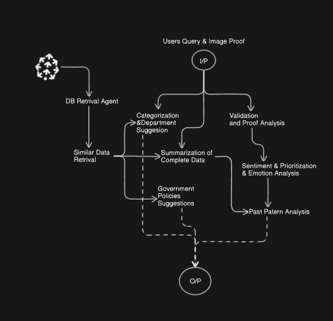
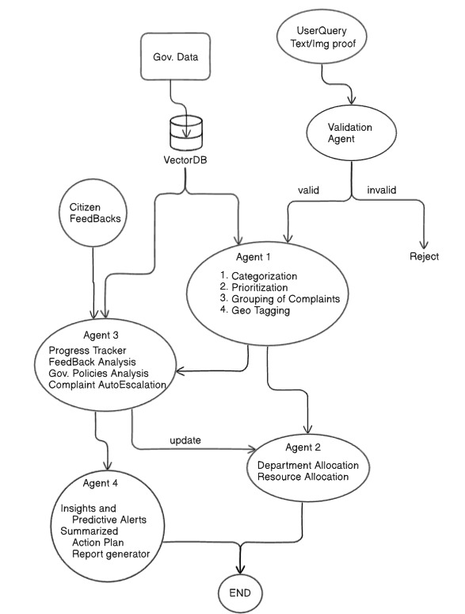

# BEProjectAgent - Intelligent Grievance Redressal System

### Agent Workflow Diagram

Project Workflow

Data Collection
Collect citizen grievance queries, categories, and department datasets from various government portals.

Data Preprocessing
Merge required columns from all datasets and perform data cleaning, preprocessing, and understanding.

Embedding Generation
Create data embeddings and store them in Pinecone/Neon vector database. Test database connections to ensure reliability.

Agent-Based Analysis
Create Validation Agent and Grievance Proof Analysis Agent to analyze grievances based on similar data points from the embeddings.

Government Policies Research agent
Develop Policy Research Agent to provide relevant policy suggestions for each grievance.

Notebook 1 : https://colab.research.google.com/drive/1TeYo3iw81YopeKblkVJ2WKxL1dADc8EZ#scrollTo=l5Gx9j-aP4f5
Notebook 2 : https://colab.research.google.com/drive/1DpOr0KJh8OFZXW3Tft3H7EgdRw4buAB5?usp=sharing
